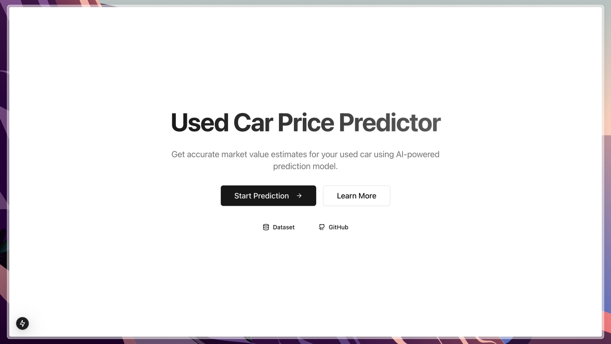
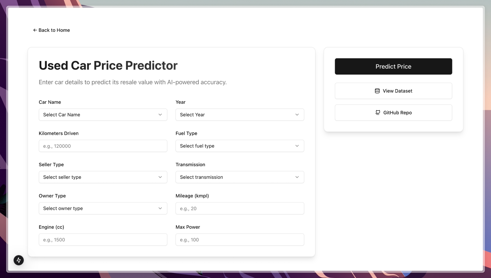
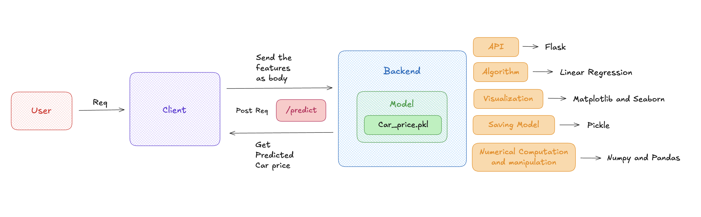

# Used Car Price Predictor


An AI-powered web application that predicts used car prices based on various features using machine learning. The project combines a Python-based machine learning model with a modern React frontend for an intuitive user experience.

## Features

- Accurate car price predictions using Linear Regression
- Interactive and responsive UI built with Next.js and Tailwind CSS
- Form validation using Zod and React Hook Form
- Modern UI components using shadcn/ui

## Architecture



## Tech Stack

### Frontend

- Next.js
- TypeScript
- Tailwind CSS
- shadcn/ui components
- React Hook Form
- Zod validation

### Backend

- Python 3.13
- Flask

### Machine Learning

- Linear Regression model
- Data preprocessing with scikit-learn
- Feature engineering
- Matplotlib and Seaborn
- Numpy and Pandas

## Getting Started

### Prerequisites

- Python 3.13+
- Node.js 18+
- npm/yarn

### Installation

1. Clone the repository:

```bash
git clone https://github.com/yourusername/Used-Car-Price-Prediction.git
cd Used-Car-Price-Prediction
```

2. Install frontend dependencies:

```bash
cd client
yarn install
```

3. Install backend dependencies:

```bash
pip install -r requirements.txt
```

### Running the Application

1. Start the frontend development server:

```bash
cd client
yarn run dev
```

2. Start the backend server:

```bash
python app.py
```

The application will be available at `http://127.0.0.1:5000`

## Model Training

The machine learning model was trained on a dataset of used car listings with the following features:

- Car name/manufacturer
- Year of manufacture
- Kilometers driven
- Fuel type
- Seller type
- Transmission
- Owner
- Mileage
- Engine capacity
- Maximum power

The model achieved the following performance metrics:

- **Mean Squared Error (MSE):** 0.0701
- **Mean Absolute Error (MAE):** 0.2074
- **Root Mean Squared Error (RMSE):** 0.2648
- **Adjusted R² Score:** 0.8117
- **R² Score:** 0.8135

## Project Structure

```
Used-Car-Price-Prediction/
├── client/              # Frontend
│   ├── app/             # Next.js app directory
│   ├── components/      # React components
│   ├── lib/             # Utility functions and validations
│   └── public/          # Static assets
├── app.py/              # API endpoints
│   car_price_model.pkl   # Trained model and preprocessing
└── Car_Price_Prediction.ipynb  # Jupyter notebooks for model development
```

## Contributing

Contributions are welcome! Please feel free to submit a Pull Request.

## License

This project is licensed under the MIT License - see the [LICENSE](LICENSE) file for details.
